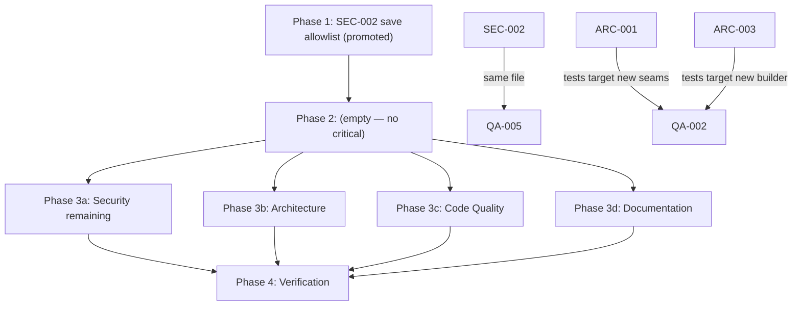

# Project Audit Report

> **Project**: par-dots
> **Date**: 2026-10-04
> **Stack**: TypeScript, Vite 8 + vite-plugin-pwa, Canvas 2D, Web Worker, IndexedDB, Vitest, Playwright, Biome, Bun (zero npm runtime dependencies)
> **Audited by**: Claude Code Audit System
> **Audited at**: HEAD `678523d` (parsight index current; 131 files, 1,368 symbols)

---

## Executive Summary

par-dots is in good health: no critical findings in any domain, a strong security posture (XSS-safe DOM construction, zero runtime dependencies, a model untrusted-backup handler), and one-way layering that is real rather than aspirational. The dominant concern is structural: the draw-your-own feature was layered onto panel play and the gallery by duplication rather than parameterization (ARC-001, ARC-003), producing roughly 300 lines of near-identical code that now collides with two in-flight backlog cards, plus a complexity hotspot in `BoardRenderer.paintCell` (QA-001). The only finding that touches player data is the cross-tab last-writer-wins persistence gap (ARC-002). Remediating the seven High findings is roughly one to two sprints of part-time work; the remaining Medium/Low items are small, independent hardening and hygiene tasks. The prior audit cycle (2026-09-26) was fully remediated and its fixes are holding.

### Issue Count by Severity

| Severity | Architecture | Security | Code Quality | Documentation | Total |
|----------|:-----------:|:--------:|:------------:|:-------------:|:-----:|
| 🔴 Critical | 0 | 0 | 0 | 0 | **0** |
| 🟠 High     | 4 | 0 | 1 | 2 | **7** |
| 🟡 Medium   | 2 | 0 | 4 | 2 | **8** |
| 🔵 Low      | 4 | 6 | 2 | 3 | **15** |
| **Total**   | **10** | **6** | **7** | **7** | **30** |

Five cross-domain duplicates were merged during dedup (raw agent count 37 → 30 issues); merged origins are noted on each affected issue.

### Known work in flight (not re-reported)

- `01a108c7` Harden editor save flush against instant reload (pagehide) — gated by ARC-001
- `01a108d2` Decide drawn-card dot count semantics with background fills — gated by ARC-003
- `01a108d3` Hide Parts chip in free palette mode (or keep as explainer)

---

## 🔴 Critical Issues (Resolve Immediately)

None found in any domain.

---

## 🟠 High Priority Issues

### [ARC-001] Draw editor and panel play duplicate the stroke-session scaffolding
- **Area**: Architecture (merges raw ARC-001 + QA-003)
- **Location**: `src/ui/drawEditor.ts:80-547` vs `src/ui/panelPlay.ts:81-387`
- **Description**: `mountDrawEditor::build` and `mountPanelPlay::build` are parallel implementations of the same layer: stroke lifecycle (`onStroke` 91 lines vs 60, `strokeTo` at 0.97 similarity), keyboard handling, persistence flush, visibility/pagehide save handlers, tray wiring, and undo/redo buttons. Parsight measures the pairs at 0.966–0.99 similarity.
- **Impact**: Every behavioral fix lands twice or drifts. The in-flight flush-hardening card is at risk of being implemented twice, into the very functions this refactor would delete.
- **Remedy**: Extract a shared stroke-session controller in `ui/` taking a session adapter (PanelSession or DrawSession); it owns tray diffing, history buttons, gesture/keyboard binding, and the persistence flush policy including the pagehide flush. Land it before or together with backlog card `01a108c7` so the hardened flush is written once.

### [ARC-002] Whole-record last-writer-wins persistence with no cross-tab coordination
- **Area**: Architecture
- **Location**: `src/ui/saves.ts:12-55`, `src/storage/db.ts:128-130`
- **Description**: The identity-map cache is per JS realm and `putSave` replaces the entire PictureSave record; there is no BroadcastChannel and no revision check on write. Two tabs holding the same save id each mutate their own copy of `placed` and whole-record put over each other.
- **Impact**: Silent lost updates: the same picture open in two tabs (PWA plus browser tab is realistic on desktop) loses progress with no error. The `whenSaved` machinery only protects in-flight writes within one tab.
- **Remedy**: BroadcastChannel "save changed externally" broadcast with cache eviction and screen remount; cheaper alternative is a monotonic `revision` field in PictureSave that `putSave` checks before writing.

### [ARC-003] Gallery card twins: `card` and `drawnCard` are 136-line near-duplicates
- **Area**: Architecture (merges raw ARC-003 + QA-001-gallery)
- **Location**: `src/ui/gallery.ts:165-280` and `282-417` (duplicated `restart` closures at 174/293, `del` at 189/308)
- **Description**: The drawn-picture feature added a second card builder instead of parameterizing the first; parsight puts similarity at 0.95. The file has zero direct unit tests, and `drawnCard` has already drifted (no done badge, progress bar, or conditional Download button).
- **Impact**: Gallery behavior must be applied twice and has diverged. The in-flight "drawn-card dot count semantics" card exists precisely because the two paths render counts differently.
- **Remedy**: Unify into one card builder parameterized by origin (`'photo' | 'drawn'`), with a shared `confirmAction` helper. Land before or with backlog card `01a108d2` so the dot-count semantics is decided and implemented once.

### [ARC-004] No error boundary around route mounting
- **Area**: Architecture
- **Location**: `src/main.ts:47-81`
- **Description**: `render()` calls `mount*(ctx)` with no try/catch, and no global error handler is installed. An exception inside any screen mount leaves a half-built screen, a null `cleanup`, and a throwing `hashchange` listener: that route is bricked until a manual reload.
- **Impact**: One bad record or unexpected exception turns a recoverable error into a dead app state, with player progress trapped behind a broken screen.
- **Remedy**: Wrap the route switch in try/catch; on failure run any partially assigned `cleanup` and render a minimal error screen with a "back to gallery" action. Roughly 15 lines in one file.

### [QA-001] `BoardRenderer.paintCell` is the top complexity-by-churn hotspot
- **Area**: Code Quality (merges raw QA-002 + ARC-005-renderer)
- **Location**: `src/render/boardRenderer.ts:265-344`; related twins at `src/render/drawBoard.ts:165` (`drawPlate`/`paintCell` pair, 0.989 similarity) and `src/game/drawSession.ts` (551 lines, 54 functions, complexity sum 141)
- **Description**: One method mixes six rendering concerns: viewport culling, stud stamp, placed dot with press-scale animation, press glint, target overlay (opacity + symbol + contrast text), completion sweep, and hint outline. Cyclomatic complexity 24 (Critical band), churn 16 in 14 days; the file ranks Critical in god-object risk.
- **Impact**: Every new visual feature edits the same method (shotgun surgery is already measurable); the overlay/hint/completion branches are exercised only indirectly via `board-motion.test.ts`.
- **Remedy**: Decompose into per-concern private methods (`paintDot`, `paintTargetOverlay`, `paintCompletionSweep`, `paintHint`) sharing the already-computed `cellDeviceRect`; extract a shared plate-paint helper from the drawBoard/boardRenderer twins; add branch tests while splitting.

### [DOC-001] README omits the draw-your-own mode and its What's-new list is stale
- **Area**: Documentation
- **Location**: `README.md` (Features, How to Play, Screenshots, "What's new" Unreleased at lines 198–204)
- **Description**: Draw mode is completely absent: no Features entry, How to Play step 1 lists only bundled/upload/link sources, the control table covers only panel play, and no screenshot shows the editor. The README's Unreleased bullets predate the CHANGELOG's newest entries: no draw mode, no guide overview/assembly pages, no raised-frame kit replacing the 1x16 ring, no three-pins-per-edge budget, no title renaming, no "No frame" export choice. PRD §5.8 and ARCHITECTURE both document draw mode; README is the outlier.
- **Impact**: The project's front door never mentions the flagship feature, and its Unreleased bullets contradict the CHANGELOG for the same version.
- **Remedy**: Add draw mode to Features and How to Play (create form, tools, "My drawings" gallery section, LEGO-mode exports), add a draw-editor screenshot, and rewrite the Unreleased bullets from CHANGELOG [Unreleased]. Land after the three in-flight backlog cards to avoid double-editing the same lines.

### [DOC-002] PRD data-model comment contradicts current free-color naming
- **Area**: Documentation
- **Location**: `PRD.md:218` (`PaletteColor` snippet in the §9 `src/types.ts` excerpt)
- **Description**: The comment reads "free mode: nearest LEGO name", but since the free-color-naming change (CHANGELOG Fixed), free colors get descriptive shade names — which PRD §8 item 3 and ARCHITECTURE (`colorNames.ts` paragraph) both state. The spec contradicts itself between sections.
- **Impact**: The data-model section documents pre-change behavior; the source of truth is wrong in one of its two statements.
- **Remedy**: Change the comment to "free mode: descriptive shade name (`engine/colorNames.ts`)".

---

## 🟡 Medium Priority Issues

### Architecture

### [ARC-005] `ui/pure.ts` is becoming a grab-bag module
- **Location**: `src/ui/pure.ts` (373 lines, fan-in 14 — highest in the codebase)
- **Description**: Routing, crop math, stroke interpolation, save construction (`buildDrawnSave`), color naming and formatting all live in one DOM-free module. It is tested and well-documented, but everything new that is "pure" defaults into it.
- **Impact**: Growing change amplification; cohesion falls as the feature count grows.
- **Remedy**: As it grows, split along existing seams into `route.ts`, `crop.ts`, `saveFactory.ts`.

### [ARC-006] `settings.sanitize` is the top churn hotspot
- **Location**: `src/storage/settings.ts:70` (churn 39, complexity 17)
- **Description**: The most rewritten function in the repo is hand-rolled per-field settings validation — the classic symptom of imperative validation with no schema to extend.
- **Impact**: Every new setting risks another rewrite of the same function and another regression surface.
- **Remedy**: Convert to a table-driven spec (field, type, default, clamp) so adding a setting is a row, not a rewrite.

### Code Quality

### [QA-002] Mount/wiring screens have no direct unit tests; coverage floor under-protects `ui/`
- **Location**: `vite.config.ts:84-85` (41% lines floor); `src/ui/setup.ts`, `src/ui/gallery.ts`, `src/ui/overview.ts`, `src/ui/panelPlay.ts` (1,630 lines combined, none imported by any test file)
- **Description**: Only the Playwright smoke test exercises these screens. `setup.ts` carries the highest 14-day churn in the repo (49 touches) and contains the quantize orchestration and fallback path. (Merges raw ARC-008 + QA-007.)
- **Impact**: Refactors of the play screens (ARC-001, ARC-003) lack a screen-level safety net.
- **Remedy**: Extract decision logic (setup's pipeline state machine, gallery's confirm actions) into DOM-free modules with tests, matching the `trayModel`/`gestures` precedent; raise the coverage floor with each addition. Sequence after ARC-001 and ARC-003 so tests target the refactored seams.

### [QA-003] `segmented()` is a byte-identical copy in two files
- **Location**: `src/ui/drawCreate.ts:37-62` and `src/ui/setup.ts:121-146` (identical AST hash, 26 lines each; the only exact duplicate in production code). (Merges raw ARC-012 + QA-004.)
- **Impact**: Classic drift risk for a shared UI control.
- **Remedy**: Hoist to `ui/dom.ts` next to `h()`/`iconButton()` and import from both call sites. Trivial, zero-risk change.

### [QA-004] `describeColor` complexity 44 — highest in the repo
- **Location**: `src/engine/colorNames.ts:4-67`
- **Description**: A pure hue/lightness/saturation decision ladder, covered by `color-names.test.ts` and `scripts/e2e-color-names.ts` — correct-but-dense rather than risky.
- **Impact**: Adding a color name means threading new thresholds into nested conditionals; misordered lightness checks are easy to introduce.
- **Remedy**: Optional: restructure as a hue-bucket table (`{maxHue, rules[]}`) evaluated by one loop. Do not prioritize above QA-001/QA-002 while tests hold it safe.

### [QA-005] `migrateSave` complexity 34 with a blanket-cast result
- **Location**: `src/storage/migrate.ts:30-81` (complexity grew +8 recently; `...(r as unknown as PictureSave)` at line 76)
- **Description**: Sequential guard chain validating identity, geometry, palette, buffers, and per-cell indexes; the spread carries forward any extra unknown fields once the guards pass. Well tested in `storage.test.ts`.
- **Impact**: Each new save field adds branches to one function; extra keys pass through to consumers.
- **Remedy**: Split into `validateIdentity`/`validatePalette`/`validateCells` helpers returning typed results, with an allowlisted result object. Land after SEC-002 (same file).

### Documentation

### [DOC-003] CHANGELOG [Unreleased] violates Keep a Changelog structure and carries stale facts
- **Location**: `CHANGELOG.md:10-53`
- **Description**: Two separate `### Added` sections under one [Unreleased] (lines 10 and 42), plus a non-standard `### Audit remediation (2026-09-26)` container heading with its own Added/Changed/Fixed/Security blocks. The remediation block preserves facts that no longer hold and contradict newer entries in the same release: "minimum color count ... (4 to 32)" (line 85) versus shipped `MIN_COLORS = 2` (`src/types.ts:16`), and "5 Technic pins per joined edge ... 1x16 brick border frame" (line 44) versus the raised-frame / three-pin Changed entries (lines 24–25).
- **Impact**: One unreleased version carries two contradictory pin budgets, frame designs, and color minimums; KaC-conformant tooling misparses the file.
- **Remedy**: Merge the duplicate Added blocks, fold remediation content into the standard categories, and amend or delete entries describing behavior that never shipped (unreleased versions may be rewritten). Land after the three in-flight backlog cards.

### [DOC-004] PRD §7 settings table is missing the `dither` setting
- **Location**: `PRD.md:174-185` (settings table)
- **Description**: `dither` exists in `src/storage/settings.ts:36` (default false) and in ARCHITECTURE's persistence table, but the PRD's localStorage reference table omits it.
- **Impact**: The settings table is the documented config reference; one key is missing.
- **Remedy**: Add a `dither` row (boolean, default false, changed on the setup screen).

---

## 🔵 Low Priority / Improvements

### Security (all hardening; posture is Strong)

### [SEC-001] CSP `connect-src` permits exfiltration to any HTTPS host
- **Location**: `vite.config.ts:14` (`"connect-src 'self' https:"`)
- **Description**: The CSP is otherwise tight (no `unsafe-inline`/`unsafe-eval` in script-src, `object-src 'none'`, `base-uri 'none'`), but `connect-src https:` whitelists every HTTPS origin, waiving the exfiltration backstop for fetch/XHR/WebSocket.
- **Impact**: A future DOM sink or compromised third-party script could POST IndexedDB contents to any attacker server without CSP intervention.
- **Remedy**: Scope to known analytics origins (`google-analytics.com`, `googletagmanager.com`, `analytics.google.com`, `static.cloudflareinsights.com`); verify GA4 regional collectors load. Batch with SEC-004 as one CSP change plus an e2e run.

### [SEC-002] `migrateSave` passes unvalidated extra fields and uncapped `name` through into saves
- **Location**: `src/storage/migrate.ts:75` (blanket spread); `name` length uncapped anywhere (type-checked only in `src/storage/backup.ts:130`)
- **Description**: All enumerated fields are validated well, but unknown properties on the raw record are spread into the returned save, and a backup inside the 200 MB cap can carry a ~150 MB name or dozens of junk fields that persist into IndexedDB.
- **Impact**: Stored-bloat/DoS and a future-confusion vector; not directly exploitable today (name renders via `textContent`).
- **Remedy**: Return an allowlisted PictureSave (id, createdAt, updatedAt, name, sourceImageId, aspect, paletteMode, origin, drawBackground, palette, width, height, target, placed, schemaVersion, panelElapsedMs) and cap `name` (e.g. 120 chars, consistent with `nameFromFile`'s 60-char cap). Do `migrate.ts` before `backup.ts` — promoted to Phase 1 because QA-005 refactors the same file.

### [SEC-003] Backup import trusts attacker-controlled Blob MIME type
- **Location**: `src/storage/backup.ts:160` (`new Blob([bytes], { type })` with any string from the file), re-served by `src/storage/db.ts:168`
- **Description**: Inert today (consumers only decode it as image data); the risk is a future consumer creating an object URL for navigation, where a `text/html` blob would render as a same-origin document.
- **Remedy**: Whitelist on import: `/^image\/(png|jpeg|webp|gif)$/` else `application/octet-stream`.

### [SEC-004] `style-src 'unsafe-inline'` may be broader than needed
- **Location**: `vite.config.ts:13`
- **Description**: All traced style application goes through CSSOM property assignment (`style.setProperty` in `src/ui/background.ts:31-34`, classList elsewhere), which CSP does not block.
- **Impact**: Only relevant combined with a future injection sink; dropping it converts style injection from possible to blocked.
- **Remedy**: Verify with a grep for `setAttribute('style'`, `cssText`, and inline `<style>`; if clean, remove `'unsafe-inline'` and run `make e2e`. Batch with SEC-001.

### [SEC-005] GA4 page path discloses save-id hash routes to Google
- **Location**: `src/analytics.ts:26-28` (`routePageView` sends `/${hash}` including `#/play/<save-id>`)
- **Description**: Every panel view sends the save's random UUID to Google Analytics. IDs are opaque `crypto.randomUUID()` values; save names never leave the device.
- **Impact**: A stable per-picture token in a third party's logs; no content reconstruction possible.
- **Remedy**: Acceptable as-is; if undesired, send `page_path: '/play'` without the id segment.

### [SEC-006] 40 MP decode guard trusts header-declared dimensions
- **Location**: `src/ui/image.ts:39-41`, `src/ui/imageHeader.ts`
- **Description**: The pixel-cap decision uses header-parsed dimensions before `createImageBitmap`; a crafted file whose header disagrees with its true decode size could slip past. Browser decode limits and the 20 MB byte caps are the real backstop, and the processing is fully client-side on the player's own file.
- **Remedy**: None required for the threat model; optionally re-check `bmp.width * bmp.height` after `createImageBitmap` and bail before `drawImage`.

### Architecture

### [ARC-007] Eager import of every screen in `main.ts`
- **Location**: `src/main.ts:7-26`
- **Description**: All seven screens statically imported, no route-level code splitting. Defensible for a PWA (Workbox precaches all chunks).
- **Remedy**: Revisit only if first-load payload matters.

### [ARC-008] `workbox-window` is a runtime import classified as a devDependency
- **Location**: `package.json:31`; imported at runtime via `virtual:pwa-register` in `main.ts`
- **Description**: Cosmetic for a bundled app; misstates intent.
- **Remedy**: Move to dependencies or leave with a comment.

### [ARC-009] Dead export `easeOutBack`
- **Location**: `src/render/layout.ts:125-130`
- **Description**: Verified zero callers (parsight find_callers empty plus dead-code scan). (Merges raw ARC-011 + QA-008.)
- **Remedy**: Delete it. The other parsight dead-code flags (`gestures.up`, `onIntent`, `playView.sync/dispose`, `playFeedback.checkFullButWrong`) are factory-returned dispatch false positives — do not delete those.

### [ARC-010] Unbounded in-memory save cache
- **Location**: `src/ui/saves.ts:12`
- **Description**: Entries are small and evicted only on delete; fine at realistic library sizes.
- **Remedy**: Noted for completeness; add eviction only if library sizes grow.

### Code Quality

### [QA-006] Three files exceed 500 lines
- **Location**: `src/ui/drawEditor.ts` (553), `src/game/drawSession.ts` (551 — cohesive state machine, acceptable), `scripts/e2e-smoke.ts` (533)
- **Remedy**: ARC-001 naturally shrinks drawEditor; no standalone action beyond watching e2e-smoke.

### [QA-007] `e2e-smoke` `main()` has complexity 25 with churn 46
- **Location**: `scripts/e2e-smoke.ts`
- **Description**: Test infrastructure, but the smoke gate is the CI deploy blocker, so its fragility is release risk.
- **Remedy**: Extract per-flow helper functions.

### Documentation

### [DOC-005] Repo-root debris: `t.xml`, `release.md`, `progress.md`
- **Location**: `t.xml` (untracked BrickLink wanted-list XML sample, stray output from testing the parts export), `release.md` (untracked Sep 27 draft announcement post), `progress.md` (tracked agent working notes nothing references)
- **Impact**: Clutter; a stray export file can be mistaken for a project artifact.
- **Remedy**: Delete `t.xml`; move `release.md` under `docs/` (or delete once posted); delete or archive `progress.md` — its content is captured in CHANGELOG and PRD.

### [DOC-006] Style-guide placeholder paths flag as broken doc links
- **Location**: `docs/DOCUMENTATION_STYLE_GUIDE.md:197,210` (`src/config.ts`, `src/client.ts`)
- **Description**: Illustrative examples in formatting tables that resolve to nothing — the repo's only two dangling links; they lack the `<!-- doc-path: example -->` waiver marker the resolver honors.
- **Remedy**: Add the waiver marker, or swap the examples for real paths such as `src/types.ts`.

### [DOC-007] README advertises two behaviors the PRD spec lacks
- **Location**: `PRD.md` §5.5 and the §7 timer sentence
- **Description**: README's Unreleased list advertises "right mouse button removes dots" and "the panel timer pauses while Settings is open"; neither appears in PRD §5.5 (Interaction) or §7.
- **Remedy**: Add one line each to §5.5 and §7.

---

## Detailed Findings

### Architecture & Design

Audited via the parsight graph (131 files, 1,368 symbols; central/bridge symbols, communities, blast radius), full reads of the persistence, session, DOM, and routing cores, plus a layering sweep of all import paths.

**Verdict**: Overall Architecture Health: Good. No critical structural defect. The key concern: the draw-your-own feature was layered onto panel play and the gallery by duplication rather than parameterization (ARC-001, ARC-003), and that duplication now collides with two of the three in-flight backlog items.

**Layering evidence**: a sweep of all import paths found zero `ui/` imports from `game/`, `engine/`, `storage/`, `render/`, or `audio/`; parsight communities map one-to-one onto directories. Persistence has a single chokepoint (`ui/` → `saves.ts` → `db.ts`, `migrateSave()` on every read, typed `StorageFullError`, transactional save+image writes). `PanelSession`/`DrawSession` are DOM-free observer state machines. Quantization runs in a Web Worker with main-thread fallback on failure, unavailability, or 20 s timeout. Build/tooling: exact-pinned dependencies, two-tier gate (`checkall`/`checkall-ci`), build-time-only CSP injection, deferred PWA update policy.

### Security Assessment

Audited via parsight source reads and semantic search. **Scope note**: the reviewing agent had no shell access in its sandbox, so no `bun audit`/lockfile CVE scan and no `git log` walk were performed; recent-change areas (parts export, overview rename) were read directly instead. See Audit Confidence.

**Verdict**: Overall Security Posture: Strong. Zero critical/high/medium findings. Highlights: no secrets anywhere (the only credential-like string is the public GA4 measurement ID); **zero npm runtime dependencies** — everything in `package.json` is an exact-pinned devDependency, an excellent supply-chain posture; DOM construction is XSS-safe by construction (`createElement`/`setAttribute`/`textContent` only — no `innerHTML`, `insertAdjacentHTML`, `outerHTML`, `document.write`, `eval`, or `new Function` anywhere); backup import is a model untrusted-input handler (format/version check, per-entry type validation, three size caps, pre-decode base64 check, structural re-validation through `migrateSave`, fresh ids on import so restore never overwrites); parts exports are injection-proof by construction (compile-time constants, hardcoded catalog keys, sanitized filename stems); strict router (`decodeURIComponent` in try/catch, digit-verified panel segments); HTTPS-only URL import with 20 MB cap and 30 s timeout; `object-src 'none'`, `base-uri 'none'`, `form-action 'none'`, `no-referrer`; typed same-origin worker boundary; allowlist-sanitized settings; deferred SW updates so play state is never lost.

### Code Quality

Audited via parsight analytics (dead code, duplicate code, god objects, most-complex functions, hotspots) plus reads of core business logic and test files.

**Verdict**: Overall Code Health: Good. Debt is low: zero TODO/FIXME/HACK markers, zero disabled lint rules (`biome-ignore` never used), consistent naming and 100-column Biome formatting. Error handling is uniformly deliberate: typed error mapping in `db.ts`, worker crash fallback with 20 s timeout in `engine/client.ts`, quota/private-mode fallbacks in `storage/quota.ts`, `userMessage()` toasts on every failure path; every sampled bare `catch` is an intentional, commented fallback. The worker request/response protocol is fully typed with id correlation and crash recovery. The main drags are the duplication findings (ARC-001, ARC-003) and the `paintCell` hotspot (QA-001).

**Test coverage**: 30 test files; logic layers (`engine/`, `game/`, `storage/`, `render/`, `ui` pure modules) well covered; key untested areas are the DOM-wiring screens (`setup.ts`, `gallery.ts`, `overview.ts`, `panelPlay.ts`), `main.ts`, `source.ts`, `install.ts`, `library.ts`; `paintCell` branches covered only indirectly (see QA-002).

### Documentation Review

Audited via parsight doc-link analysis plus full reads of every docs file.

**Verdict**: Overall Documentation Health: Good. The doc graph is healthy: 22 doc-to-doc links with only 2 unresolved (both intentional placeholders — DOC-006); TSDoc coverage is near-total (576 `/**` blocks across 67 files, every file has a module doc — a payoff of the 2026 audit remediation); PRD and ARCHITECTURE are current through all four recent feature areas (draw mode, printable guide with assembly instructions, parts exports with no-frame option, picture renaming). Inventory: README present-good but stale on draw mode (DOC-001); no generated API reference (in-source TSDoc is good); CHANGELOG good content with structure issues (DOC-003); contributing covered adequately inside README; `docs/DEPLOYMENT.md` excellent (workflow table, domain setup, release verification, rollback, troubleshooting, explicit "no env vars or secrets").

---

## Remediation Roadmap

### Immediate Actions (Before Next Deployment)
1. ARC-004 — error boundary around route mounting (small, protects players from bricked routes)
2. SEC-002 — save-field allowlist and name cap (promoted to Phase 1; unblocks QA-005)

### Short-term (Next 1–2 Sprints)
1. ARC-001 — shared stroke-session controller (gates the in-flight flush-hardening card)
2. ARC-003 — unify gallery card builders (gates the in-flight dot-count semantics card)
3. ARC-002 — cross-tab save coordination
4. QA-001 — decompose `paintCell` and the plate-paint twins
5. QA-002 — screen-level tests for the refactored seams
6. DOC-001, DOC-002 — README draw mode + PRD comment fix (after the in-flight cards land)

### Long-term (Backlog)
1. ARC-005, ARC-006 — pure.ts split, table-driven settings sanitize
2. QA-003, QA-004, QA-005 — segmented hoist, describeColor restructure, migrateSave split
3. SEC-001…SEC-006 — CSP scoping and import hardening (batched CSP change)
4. All remaining Low items

---

## Positive Highlights

1. **Zero npm runtime dependencies** — everything is an exact-pinned devDependency; a genuinely excellent supply-chain posture for a shipped PWA.
2. **XSS-safe by construction** — DOM built exclusively through `createElement`/`setAttribute`/`textContent`; no HTML-string sinks, `eval`, or `new Function` anywhere.
3. **One-way layering is real** — zero `ui/` imports from lower layers across all import paths; parsight communities map one-to-one onto directories.
4. **Model untrusted-input handling** — the backup importer validates format, types, and three size levels, re-validates through `migrateSave`, and imports as fresh saves that can never overwrite.
5. **Deliberate error handling everywhere** — typed storage errors, worker crash fallback with timeout, quota fallbacks, and `userMessage()` toasts on every failure path; zero TODO/FIXME markers and zero disabled lint rules.
6. **Deterministic, resilient engine** — seeded quantization in a Web Worker with a main-thread fallback on failure or 20 s timeout.
7. **Documentation discipline pays off** — 576 TSDoc blocks across 67 files with every file carrying a module doc; PRD and ARCHITECTURE current through all four recent feature areas.
8. **Two-tier verification gate** — `checkall`/`checkall-ci` with an e2e smoke test that gates deploys, plus a deferred PWA update policy that never loses play state to a reload.

---

## Audit Confidence

| Area | Files Reviewed | Confidence |
|------|---------------|-----------|
| Architecture | 131 files via graph; ~15 core files read in full | High |
| Security | 131 files via semantic search; entry points, storage, export, CSP traced | Medium — no shell in the review sandbox, so no `bun audit` lockfile CVE scan was run; recommend a follow-up `bun audit` |
| Code Quality | 131 files via analytics; hotspots and core logic read | High |
| Documentation | All 8 docs files read in full; link graph analyzed | High |

*The Medium security confidence is scoped to dependency CVEs only; the manual source review was thorough.*

---

## Remediation Plan

> This section is generated by the audit and consumed directly by `/fix-audit`.
> It pre-computes phase assignments and file conflicts so the fix orchestrator
> can proceed without re-analyzing the codebase.

### Phase Assignments

#### Phase 1 — Critical Security (Sequential, Blocking)
<!-- SEC-002 is promoted here by rule: it modifies `src/storage/migrate.ts`, a conflict file also targeted by Code Quality (QA-005). Severity is Low, not Critical. -->
| ID | Title | File(s) | Severity |
|----|-------|---------|----------|
| SEC-002 | Allowlist migrateSave output fields and cap save name length | `src/storage/migrate.ts`, `src/storage/backup.ts` | Low (promoted) |

#### Phase 2 — Critical Architecture (Sequential, Blocking)
<!-- Empty: no Critical findings in any domain. -->
| ID | Title | File(s) | Severity | Blocks |
|----|-------|---------|----------|--------|
| — | (none) | — | — | — |

#### Phase 3 — Parallel Execution

**3a — Security (remaining)**
| ID | Title | File(s) | Severity |
|----|-------|---------|----------|
| SEC-001 | Scope CSP connect-src to known analytics origins | `vite.config.ts` | Low |
| SEC-003 | Whitelist MIME type on backup image import | `src/storage/backup.ts` | Low |
| SEC-004 | Drop style-src unsafe-inline if no inline style writes exist | `vite.config.ts` | Low |
| SEC-005 | Consider stripping save-id segments from GA4 page paths | `src/analytics.ts` | Low |
| SEC-006 | Re-check decoded bitmap dimensions after createImageBitmap | `src/ui/image.ts` | Low |

*SEC-001 and SEC-004 must be batched into one CSP change with an e2e run (both edit the `vite.config.ts` CSP array).*

**3b — Architecture (remaining)**
| ID | Title | File(s) | Severity |
|----|-------|---------|----------|
| ARC-001 | Extract shared stroke-session controller | `src/ui/drawEditor.ts`, `src/ui/panelPlay.ts` | High |
| ARC-002 | Cross-tab save coordination (BroadcastChannel or revision check) | `src/ui/saves.ts`, `src/storage/db.ts` | High |
| ARC-003 | Unify gallery card builders | `src/ui/gallery.ts` | High |
| ARC-004 | Error boundary around route mounting | `src/main.ts` | High |
| ARC-005 | Split ui/pure.ts along its seams | `src/ui/pure.ts` | Medium |
| ARC-006 | Table-driven settings sanitize | `src/storage/settings.ts` | Medium |
| ARC-007 | Route-level code splitting (optional) | `src/main.ts` | Low |
| ARC-008 | Reclassify workbox-window as runtime dep | `package.json` | Low |
| ARC-009 | Delete dead easeOutBack | `src/render/layout.ts` | Low |
| ARC-010 | Bound or document the in-memory save cache | `src/ui/saves.ts` | Low |

*ARC-001 lands before or together with backlog card `01a108c7` (pagehide flush), with the hardened flush written inside the extracted controller. ARC-003 lands before or together with backlog card `01a108d2` (dot-count semantics).*

**3c — Code Quality (all)**
| ID | Title | File(s) | Severity |
|----|-------|---------|----------|
| QA-001 | Decompose paintCell and dedupe plate-paint twins | `src/render/boardRenderer.ts`, `src/render/drawBoard.ts`, `src/game/drawSession.ts` | High |
| QA-002 | Screen-level tests + raise coverage floor | `vite.config.ts`, `src/ui/setup.ts`, `src/ui/gallery.ts`, `src/ui/overview.ts`, `src/ui/panelPlay.ts` | Medium |
| QA-003 | Hoist duplicated segmented() helper | `src/ui/drawCreate.ts`, `src/ui/setup.ts` | Medium |
| QA-004 | Restructure describeColor as hue-bucket table (optional) | `src/engine/colorNames.ts` | Medium |
| QA-005 | Split migrateSave validators, allowlist result | `src/storage/migrate.ts` | Medium |
| QA-006 | Oversized files (revisit after ARC-001) | `src/ui/drawEditor.ts`, `src/game/drawSession.ts`, `scripts/e2e-smoke.ts` | Low |
| QA-007 | Extract per-flow helpers in e2e-smoke | `scripts/e2e-smoke.ts` | Low |

*QA-005 runs after Phase 1 (SEC-002) — same file. QA-002 runs after ARC-001 and ARC-003 so tests target the refactored seams.*

**3d — Documentation (all)**
| ID | Title | File(s) | Severity |
|----|-------|---------|----------|
| DOC-001 | README draw mode + What's-new rewrite | `README.md` | High |
| DOC-002 | Fix PRD free-color naming comment | `PRD.md` | High |
| DOC-003 | Restructure CHANGELOG Unreleased, drop stale facts | `CHANGELOG.md` | Medium |
| DOC-004 | Add dither row to PRD §7 settings table | `PRD.md` | Medium |
| DOC-005 | Clean repo-root debris | `t.xml`, `release.md`, `progress.md` | Low |
| DOC-006 | Waive or fix style-guide placeholder links | `docs/DOCUMENTATION_STYLE_GUIDE.md` | Low |
| DOC-007 | Document right-click removal + timer pause in PRD | `PRD.md` | Low |

*DOC-001 and DOC-003 should land after the three in-flight backlog cards close — each of those adds [Unreleased] entries, and both docs rework the same lines.*

### File Conflict Map

| File | Domains | Issues | Risk |
|------|---------|--------|------|
| `src/storage/migrate.ts` | Security + Code Quality | SEC-002, QA-005 | ⚠️ Read before edit; SEC-002 (Phase 1) lands first |
| `vite.config.ts` | Security + Code Quality | SEC-001, SEC-004, QA-002 | ⚠️ Read before edit; batch the two CSP edits |
| `src/ui/gallery.ts` | Architecture + Code Quality | ARC-003, QA-002 | ⚠️ Read before edit; QA-002 tests target ARC-003's unified builder |
| `src/ui/panelPlay.ts` | Architecture + Code Quality | ARC-001, QA-002 | ⚠️ Read before edit; QA-002 tests target ARC-001's controller |
| `src/ui/drawEditor.ts` | Architecture + Code Quality | ARC-001, QA-006 | ⚠️ Informational — QA-006 resolves via ARC-001 |

Same-domain overlaps (sequence within the domain, no cross-domain risk): `src/ui/saves.ts` (ARC-002 + ARC-010), `src/ui/setup.ts` (QA-002 + QA-003), `src/game/drawSession.ts` (QA-001 + QA-006), `src/main.ts` (ARC-004 + ARC-007).

### Blocking Relationships

- SEC-002 → QA-005: SEC-002's allowlist changes the save shape QA-005's validator split must preserve; same file (`src/storage/migrate.ts`), so sequential, not parallel. Within SEC-002, `migrate.ts` before `backup.ts` (the allowlist changes what `backup.ts` decodeEntry feeds).
- ARC-001 → QA-002: tests must target the extracted stroke-session controller's seams, not the duplicated code it replaces.
- ARC-003 → QA-002: same for the unified gallery card builder.
- ARC-001 → backlog card `01a108c7` (Harden editor save flush): if the flush hardening is implemented per-screen first, it is written twice into functions ARC-001 then deletes; implement it inside the extracted controller.
- ARC-003 → backlog card `01a108d2` (Drawn-card dot count semantics): deciding semantics inside two divergent card builders guarantees an inconsistent implementation; unify first.
- DOC-001 + DOC-003 → after backlog cards `01a108c7` / `01a108d2` / `01a108d3` close (all three add [Unreleased] entries that those docs rework).

### Dependency Diagram

