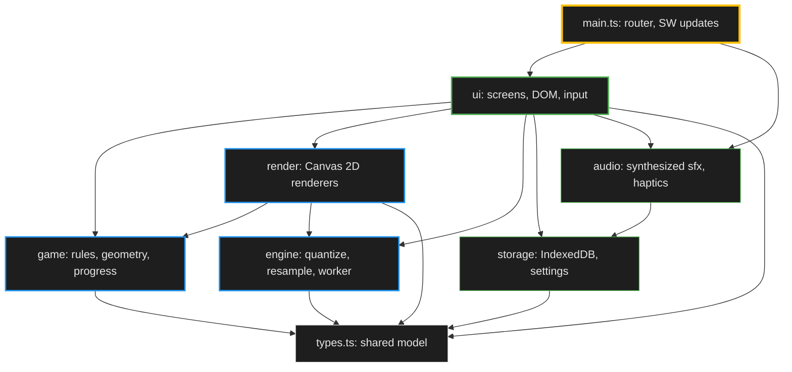
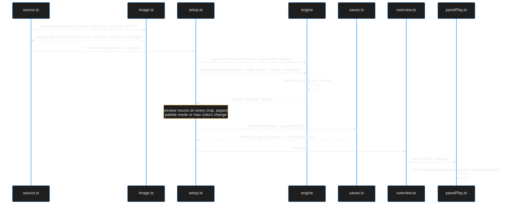

# Architecture

How par-dots is organized: the source layers, how a photo becomes a playable picture, the routes, what is persisted, and how the PWA updates. Read this before changing code; read [PRD.md](../PRD.md) for what the game does.

## Table of Contents

- [Overview](#overview)
- [Layers](#layers)
- [New-Picture Pipeline](#new-picture-pipeline)
- [Routes and Screens](#routes-and-screens)
- [Panel Play Screen](#panel-play-screen)
- [Persistence](#persistence)
- [PWA and Updates](#pwa-and-updates)
- [Conventions](#conventions)
- [Where to Start Reading](#where-to-start-reading)
- [Related Documentation](#related-documentation)

## Overview

par-dots is a static, backend-free single-page app built with Vite and TypeScript, with no UI framework. Screens are plain DOM built by a small `h()` helper, the boards are drawn on Canvas 2D, image quantization runs in a Web Worker, and all state lives on the device in IndexedDB and localStorage. `src/main.ts` is the entry point: it owns the hash router and the service-worker update policy.

## Layers

Dependencies point one way. `ui/` sits on top; the lower layers never import `ui/`, and `engine/`, `game/` and `storage/` import only `src/types.ts` and their own siblings.

| Directory | Owns | Notes |
| --- | --- | --- |
| `src/types.ts` | `Mosaic`, `PictureSave`, `PaletteColor`, `LAYOUT`, `EMPTY`, color limits | The shared model every layer imports |
| `src/engine/` | Image math: crop and area-average resample (`resample.ts`), quantization (`quantize.ts`), Lab color math (`color.ts`), the LEGO color table (`legoPalette.ts`), the quantize worker and its client | DOM-free; runs in a worker or on the main thread |
| `src/game/` | Panel geometry (`geometry.ts`), per-panel rules and undo/redo (`panelSession.ts`), progress (`progress.ts`) | DOM-free; `PanelSession` mutates `save.placed` in place and emits events |
| `src/render/` | `BoardRenderer` (one 16x16 panel), `OverviewRenderer` (the whole picture), offscreen mosaic images, sprites, layout math, shared canvas helpers | Knows nothing about screens; `render/color.ts` reuses `engine/color.ts` |
| `src/storage/` | IndexedDB (`db.ts`), save validation and migration (`migrate.ts`), settings (`settings.ts`), id generation (`id.ts`) | `ui/` reaches `db.ts` only through `src/ui/saves.ts` |
| `src/audio/` | Web Audio sounds and `navigator.vibrate` haptics (`sfx.ts`) | Reads settings on every call |
| `src/ui/` | Screens, DOM helpers, input handling, the save repository, navigation handoff state | The only layer that touches the document |

## New-Picture Pipeline

A picture is created on two screens. The source screen decodes the chosen image; the setup screen crops, resamples and quantizes it, then writes the save.

- `src/ui/image.ts` reads the image header with `readImageSize()` (`src/ui/imageHeader.ts`) and rejects more than `MAX_SOURCE_PIXELS` (40 MP) before `createImageBitmap` allocates the pixels.
- `src/engine/client.ts` falls back to running `buildMosaic()` on the main thread when workers are unavailable, when the worker crashes, or when a job takes longer than `QUANTIZE_TIMEOUT_MS` (20 s).
- `buildMosaic()` in `src/engine/quantize.ts` is deterministic: LEGO mode picks colors from `LEGO_COLORS` by greedy selection and swap refinement when more LEGO colors are in play than the limit allows; free mode runs seeded k-means++ and Lloyd iterations in Lab when the image has more distinct colors than the limit. Both then merge colors closer than `MIN_DELTA_E` and sort the palette by lightness.
- Stud size comes from `studDims(aspect)` in `src/game/geometry.ts`, the single owner of panel geometry.

## Routes and Screens

`src/main.ts` listens for `hashchange`, parses the hash with `parseRoute()` (`src/ui/pure.ts`), and mounts one screen. Every screen follows the same contract from `src/ui/screen.ts`: `mount(ctx, ...params)` builds DOM into `ctx.root` and returns a `Cleanup` that the router calls before mounting the next screen. The router also closes every open sheet and celebration through the overlay registry in `src/ui/dom.ts`.

| Hash | Route | Mount function | File |
| --- | --- | --- | --- |
| `#/` | `gallery` | `mountGallery` | `src/ui/gallery.ts` |
| `#/new` | `new` | `mountSource` | `src/ui/source.ts` |
| `#/setup` | `setup` | `mountSetup` | `src/ui/setup.ts` |
| `#/play/:id` | `overview` | `mountOverview` | `src/ui/overview.ts` |
| `#/play/:id/:panel` | `panel` | `mountPanelPlay` | `src/ui/panelPlay.ts` |

Any other hash, including one with a malformed percent-escape, falls back to the gallery. `#/setup` depends on in-memory handoff state (`setPendingSource` in `src/ui/state.ts`), so opening it directly redirects to `#/new`. `src/ui/state.ts` also carries the transition hint that lets the overview zoom out from the panel just left and show the finale.

## Panel Play Screen

`src/ui/panelPlay.ts` is wiring: it loads the save, builds the view, and connects modules that each own one concern.

| Module | Owns |
| --- | --- |
| `src/game/panelSession.ts` | Rules for one panel: strokes, tray colors, undo/redo (10 moves), completion, change events |
| `src/ui/playView.ts` | Static DOM for the screen and the color tray view |
| `src/ui/gestures.ts` | DOM-free pointer model: touch hold, pinch grace, pan mode, turning pointers into stroke, pan and zoom intents |
| `src/ui/boardInput.ts` | Binds canvas pointer and wheel events to the gesture model and applies pan and zoom to the renderer viewport |
| `src/ui/panelTimer.ts` | Visible-time accounting per panel |
| `src/ui/trayModel.ts` | Tray diffing and remaining counts |
| `src/ui/playFeedback.ts` | Sounds, haptics and cell redraws driven by `PanelSession` events, including the full-but-wrong buzz |
| `src/render/boardRenderer.ts` | Drawing the 16x16 board, hit testing, press and hint animations |

Game rules stay in `game/`: `ui/` never decides whether a dot is correct, it asks `PanelSession`.

## Persistence

| Store | Where | Contents |
| --- | --- | --- |
| IndexedDB `par-dots`, version 1, store `saves` | `src/storage/db.ts` | `PictureSave` records, keyPath `id` |
| IndexedDB `par-dots`, store `images` | `src/storage/db.ts` | Uploaded image blobs, keyed by the save's `sourceImageId`; library pictures use `library:<slug>` and have no blob |
| localStorage `par-dots:settings` | `src/storage/settings.ts` | `Settings` (sound, place sound, haptics, palette mode, max colors), cached in memory |
| localStorage `par-dots:install-prompt-dismissed` | `src/ui/install.ts` | Whether the one-time install prompt was shown |

- `src/ui/saves.ts` is the save repository and the only persistence entry point for `ui/`. It keeps one in-memory object per save id, so the overview and panel play share the same `placed` array.
- New uploads go through `createSave(save, blob)`, which writes the image and the save in one transaction (`putSaveWithImage`). A quota error surfaces as `StorageFullError`.
- Panel play writes the save at the end of each stroke, after undo/redo, when the page is hidden, on unmount, and when the panel completes.
- Every read passes through `migrateSave()` in `src/storage/migrate.ts`, which validates the shape against `LAYOUT` and the palette and stamps `schemaVersion`. Records that are malformed or come from a newer build are skipped with a warning.
- Backups (`src/storage/backup.ts`) are one JSON document (`format: 'par-dots-backup'`, `version: 1`) holding each save with base64 `target`/`placed` and, for uploads, the base64 image. Import caps a file at 200 MB and 200 saves and each image at 20 MB, runs every save through `migrateSave()`, drops invalid ones, and writes each as a new save with fresh save and image ids, so a restore never overwrites existing progress.
- To change the save shape, bump `SAVE_SCHEMA_VERSION` in `src/types.ts` and add the upgrade step to `migrateSave()`. The IndexedDB `DB_VERSION` only needs to change when object stores or indexes change.

## PWA and Updates

`vite-plugin-pwa` generates the service worker and manifest from `vite.config.ts`.

- **Precache:** every built `html`, `css`, `js`, `svg`, `png`, `webp`, `json` and `webmanifest` file, which includes the bundled library in `public/library/` and its `manifest.json`, plus the favicons, the Apple touch icon and `CNAME`. After the first load, the app plays fully offline.
- **Registration:** `registerType: 'prompt'`, so a new deploy waits instead of reloading tabs on its own.
- **Update checks:** `watchForUpdates()` in `src/ui/swUpdate.ts` calls `registration.update()` every 60 minutes (`UPDATE_CHECK_MS`) and whenever the page becomes visible.
- **Applying an update:** `maybeApplyUpdate()` in `src/main.ts` asks `shouldApplyUpdate()` (`src/ui/pure.ts`). It activates a waiting worker, or reloads after another tab activated one, only when the page is hidden, or when it is on the gallery or overview with no sheet or dialog open. Mid-stroke play and setup state are never lost to a reload. On hide, the check waits one second so the panel's own save finishes first.
- **Content Security Policy:** the production build injects a CSP `<meta>` tag (`script-src 'self'`, `connect-src 'self' https:` for image links, `object-src 'none'`). The dev server omits it because Vite needs inline scripts and an HMR socket. `index.html` sets `referrer` to `no-referrer`.

## Conventions

- **Imports by file path.** `src/game/index.ts` is the one barrel, because `game/` exposes a cohesive API (session, geometry, progress). Other directories are imported by file path, and `render/overviewRenderer.ts` imports `game/geometry.ts` directly. Add a barrel only when a directory grows a similarly cohesive public API.
- **Screen contract.** `mount*` returns a `Cleanup`; async work checks an `alive` flag before touching the DOM after an await.
- **DOM construction.** Build elements with `h()`, `icon()` and `iconButton()` from `src/ui/dom.ts`. They set attributes and text only, never HTML strings.
- **Overlays.** Sheets, dialogs and celebrations register with `registerOverlay()` so the router and the Escape key can close them.
- **Pure helpers.** Logic that does not need the DOM (routing, crop math, formatting, gestures, timers, tray diffs) lives in DOM-free modules with unit tests in `tests/`.
- **Errors shown to the player** go through `userMessage()` in `src/ui/pure.ts`.

## Where to Start Reading

1. `src/types.ts` for the data model.
2. `src/main.ts` for routing and updates.
3. `src/game/panelSession.ts` for the rules.
4. `src/ui/setup.ts` and `src/engine/quantize.ts` for picture creation.
5. `src/ui/panelPlay.ts` for how play is wired together.

## Related Documentation

- [PRD.md](../PRD.md) - Product requirements and behavior as built
- [README.md](../README.md) - Setup, commands and contributing
- [DEPLOYMENT.md](DEPLOYMENT.md) - Build, deploy, verification and rollback
- [DOCUMENTATION_STYLE_GUIDE.md](DOCUMENTATION_STYLE_GUIDE.md) - How to write docs in this repository
